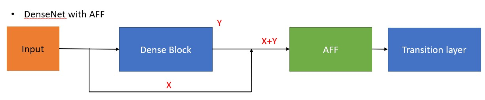

# DenseNet-with-AFF-module

[Attentional feature fusion](https://arxiv.org/abs/2009.14082)

[ICDAR 2013 Chinese Handwriting Recognition Competition](https://ieeexplore.ieee.org/abstract/document/6628856)

What's in this repo so far
- code for training ICDAR dataset
- code for DenseNet with AFF module

## Experiments

### ICDAR2013 Test Datasets
| Architecture                | Top1 Accuracy(%) |
| -------------------         |:-------------:   |
| Fujitsu[[1]](./README.md#References)                     | 94.77            | 
| IDSIAnn[[2]](./README.md#References)                      | 94.42            |
| MCDNN[[3]](./README.md#References)                        | 95.79            |  
| GoogleNet-ResNet[[4]](./README.md#References)             | 97.03            | 
| Google-ResNet+triplet loss[[5]](./README.md#References)   | 97.03            | 
| ResNet+Center loss[[6]](./README.md#References)           | 97.03            | 
| DenseNet+AFF(ours)          | 97.23            |

## References
[1] Yin, F., Wang, Q. F., Zhang, X. Y., & Liu, C. L. (2013, August). ICDAR 2013 Chinese handwriting recognition competition. 
In 2013 12th international conference on document analysis and recognition (pp. 1464-1470). IEEE.

[2] Yin, F., Wang, Q. F., Zhang, X. Y., & Liu, C. L. (2013, August). ICDAR 2013 Chinese handwriting recognition competition. 
In 2013 12th international conference on document analysis and recognition (pp. 1464-1470). IEEE.

[3] Cireşan, D., & Meier, U. (2015, July). Multi-column deep neural networks for offline handwritten Chinese character classification. 
In 2015 international joint conference on neural networks (IJCNN) (pp. 1-6). IEEE.

[4] Cheng, C., Zhang, X. Y., Shao, X. H., & Zhou, X. D. (2016, October). Handwritten Chinese character recognition by joint classification and similarity ranking. 
In 2016 15th International Conference on Frontiers in Handwriting Recognition (ICFHR) (pp. 507-511). IEEE.

[5] Cheng, C., Zhang, X. Y., Shao, X. H., & Zhou, X. D. (2016, October). Handwritten Chinese character recognition by joint classification and similarity ranking. 
In 2016 15th International Conference on Frontiers in Handwriting Recognition (ICFHR) (pp. 507-511). IEEE.

[6] Zhang, R., Wang, Q., & Lu, Y. (2017, November). Combination of ResNet and center loss based metric learning for handwritten Chinese character recognition. 
In 2017 14th IAPR International Conference on Document Analysis and Recognition (ICDAR) (Vol. 5, pp. 25-29). IEEE.
